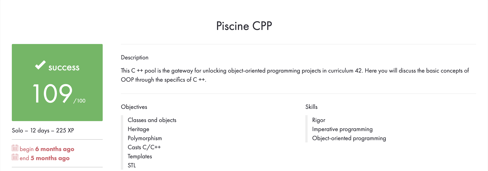

# CPP BOOTCAMP

## Prerequisites
* g++ (compiler)

## Description
2 Weeks. Intensive programming bootcamp. An introduction to the C++ programming language and the basic concepts of OOP (object oriented programming).

## Overall Achievements


## File Structure
```
cpp_bootcamp
│
│   README.md
│   
└───docs
│   │
│   └───pdfs (pdfs for each day's exercises)
│
│   overview.png
│
└───day00
│
└───day01
│   
└───day02
│
└───day03
│
└───day04
│
└───day05
│
└───day06
│
└───day07
│
└───day08
```
## Compiling and Executing
In general you would compile any C++ program using gcc, including the source code and headers, as well as any flags you'd like to implement. i.e.

```
g++ -Wall -Werror -Wextra main.cpp main.hpp
```
Which will result in an executable that you simply run. i.e.
```
./a.out
```
For exercises containing Makefiles you simply execute the following command
```
make all
```
To clean up all the object files generated from the command above you can execute the following command
```
make clean
```
To clean up all object files and executables generated from the "make all" command you can execute the following command
```
make fclean
```
To clean  up all object files and executables and then compile your code you can execute the following command
```
make re
```